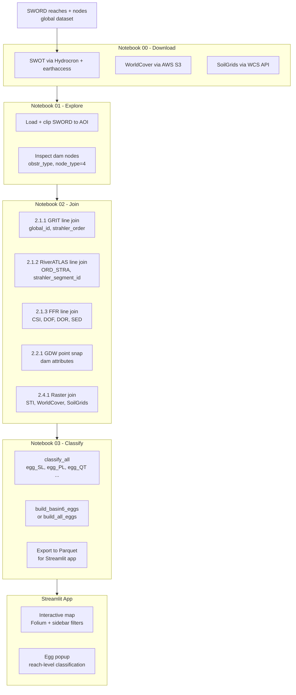
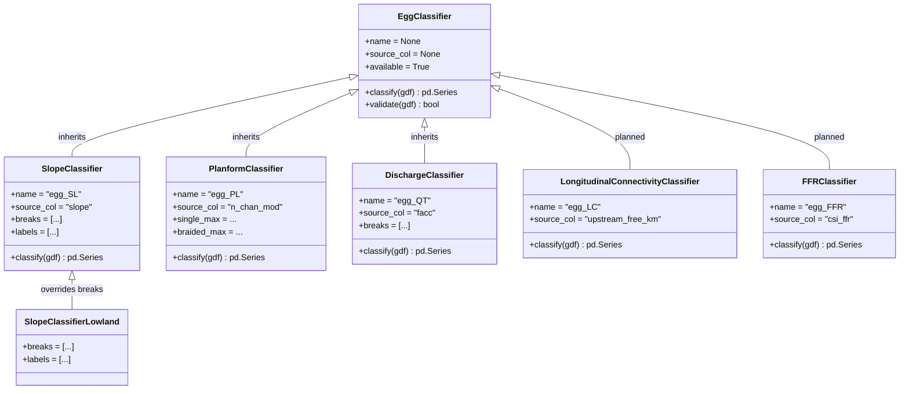
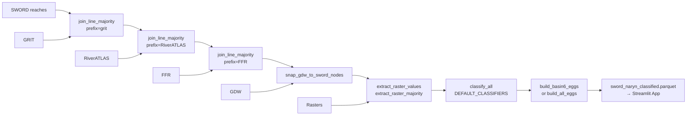

# ARCHITECTURE - RiverEggCode

## Table of Contents

1. [Project Goal](#1-project-goal)
2. [Design Principles](#2-design-principles)
3. [Pipeline Overview](#3-pipeline-overview)
4. [Source File Map](#4-source-file-map)
5. [OOP Classifier Structure](#5-oop-classifier-structure)
6. [Egg Structure](#6-egg-structure)
7. [Data Flow](#7-data-flow)
8. [Open Decisions](#8-open-decisions)

---

## 1. Project Goal

RiverEggCode is using a WMO Egg Code approach to classify riversystems based on the SWORD dataset by the *University of North Carolina at Chapel Hill*. Spatially connected reaches are grouped into **Eggs**, which is a compact morphological description across several dimensions (planform, discharge, connectivity, etc.). Results are visualised in an interactive Streamlit web application.

The pipeline is designed to be:
- **Studyarea agnostic** - change `STUDY_AREA` once, the entire pipeline adapts
- **Extensible** - new Egg dimensions can be added without touching existing code
- **Globally scalable** - tested on different rivers (e.g. Naryn, Elbe), designed for global use

---

## 2. Design Principles

**Single configuration variable.** `STUDY_AREA` (e.g. `"naryn"`) is defined once
in the configuration cell of each notebook. All file paths, joins, and outputs
derive from this variable automatically. 

**OOP for classifiers.** Every Egg dimension is implemented as a subclass of
`EggClassifier`. Adding a new dimension means writing one new class, so no changes
to existing code are required.

**Separation of concerns.** Each source file has one clear responsibility:
- `_2_x_x_*.py` files handle data joining
- `_3_1_x_*.py` files compute derived features (graph-based, complex logic)
- `_3_2_1_classifier.py` classifies features into Egg categories
- `_3_2_2_eggcode.py` aggregates classified reaches into Eggs

**Dynamic over hardcoded.** `REACH_EGG_COLS`, `egg_to_string()`, and
`egg_to_dataframe()` all derive their column lists dynamically from the classifier
registry. Adding a new classifier automatically propagates to all outputs.

---

## 3. Pipeline Overview



---

## 4. Source File Map

| File | Responsibility | Key Functions |
|------|---------------|---------------|
| `_00_config.py` | Global settings | `WD_AVAILABLE`, raster buffer params |
| `_0_config_paths.py` | Path configuration | `DATA_RAW`, `DATA_PROCESSED`, `STUDY_AREA` |
| `_00_download_rs_data.py` | Download functions | `query_hydrocron_bulk`, `stream_swot_granules`, `download_worldcover`, `download_soilgrids` |
| `_2_1_1_line.py` | Line joins | `join_line_majority`, `compute_strahler_segments` |
| `_2_1_2_point.py` | Point snapping | `snap_gdw_to_sword_nodes` |
| `_2_2_1_raster.py` | Raster joins | `extract_raster_values`, `extract_raster_majority`, `compute_buffer_radius` |
| `_3_1_1_compute_features.py` | Feature computation | `build_sword_graph`, `compute_upstream_free_distance` |
| `_3_2_1_classifier.py` | OOP classifiers | `EggClassifier`, `SlopeClassifier`, `PlanformClassifier`, `DischargeClassifier`, `classify_all` |
| `_3_2_2_eggcode.py` | Egg aggregation | `build_basin6_eggs`, `build_all_eggs`, `egg_to_string`, `egg_to_dataframe` |

---

## 5. OOP Classifier Structure

Every Egg dimension is implemented as a subclass of `EggClassifier`.
The base class defines the interface; subclasses override only what changes.



**River Profiles**: study-area specific classifier configurations:

```python
DEFAULT_CLASSIFIERS  # all rivers: SlopeClassifier, PlanformClassifier, DischargeClassifier
LOWLAND_CLASSIFIERS  # e.g. Elbe: SlopeClassifierLowland, PlanformClassifier, DischargeClassifier
```

**Adding a new Egg dimension:**
1. Write a subclass of `EggClassifier` in `_3_2_1_classifier.py`
2. Add it to `DEFAULT_CLASSIFIERS`
3. `REACH_EGG_COLS`, `egg_to_string()`, and `egg_to_dataframe()` update automatically

---

## 6. Egg Structure

An Egg is a group of spatially connected SWORD reaches that share the same
Pfafstetter Level 6 basin (encoded in the first 6 digits of `reach_id`).

```
SWORD reach_id format: CBBBBBRRRRT
  C      = Continent (1 digit)
  BBBBB  = Pfafstetter basin up to Level 6 (5 digits)
  RRR    = Reach number within basin (3 digits)
  T      = Type (1 digit)

First 6 digits (CBBBBB) = basin_6 = Egg group ID
```

**Egg dictionary structure:**

```
egg = {
    "global_id"  : "462193",     # Pfafstetter Level 6 basin code
    "n_reaches"  : 12,           # number of SWORD reaches in this Egg
    "RT"         : None,         # River Type (placeholder, pending confinement data)
    "reaches"    : [             # sorted upstream --> downstream via dist_out
        {
            "reach_id"      : 46219300091,
            "len_m"         : 14231,
            "strahler_order": 5,
            "egg_SL"        : 2,
            "egg_PL"        : "St",
            "egg_QT"        : 3,
        },
        ...
    ]
}
```

**Two grouping approaches are implemented:**

| Approach | Function | Grouped by | Strahler |
|----------|----------|------------|----------|
| Basin-6 | `build_basin6_eggs()` | Pfafstetter Level 6 basin | reach-level attribute |
| Strahler segment | `build_all_eggs()` | `strahler_segment_id_RiverATLAS` | egg-level attribute |

---

## 7. Data Flow



---

## 8. Open Decisions

| Topic | Status | Notes |
|-------|--------|-------|
| Label format (int vs string) | Pending supervisor review | `egg_SL`, `egg_QT` currently int; `egg_PL` string |
| `egg_TM` Transport Mode | Deferred | Needs independent sediment transport dataset |
| `egg_WD` Width/Depth | Deferred | Needs depth dataset |
| `egg_RT` River Type | Deferred | Needs confinement dataset (Copernicus DEM + valley width) |
| `egg_LC` Longitudinal Connectivity | In progress | `build_sword_graph()` implemented, classifier pending |
| `egg_FFR` Free-Flowing Rivers | Planned | FFR data joined, classifier pending |
| Threshold calibration | Pending | Current breaks are Naryn-specific placeholders |
| Strahler concept | Pending supervisor | basin_6 vs strahler_segment grouping |
| Streamlit deployment | Planned | App runs locally, Streamlit Cloud deployment pending |
A Lot moreeeeeeeeee